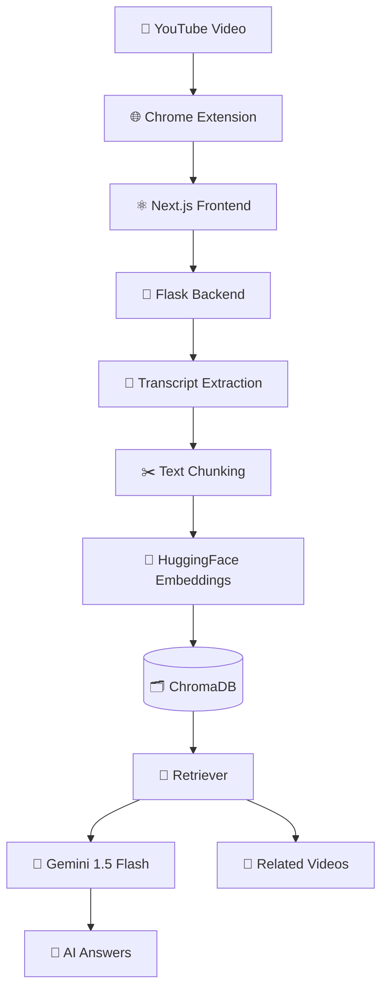
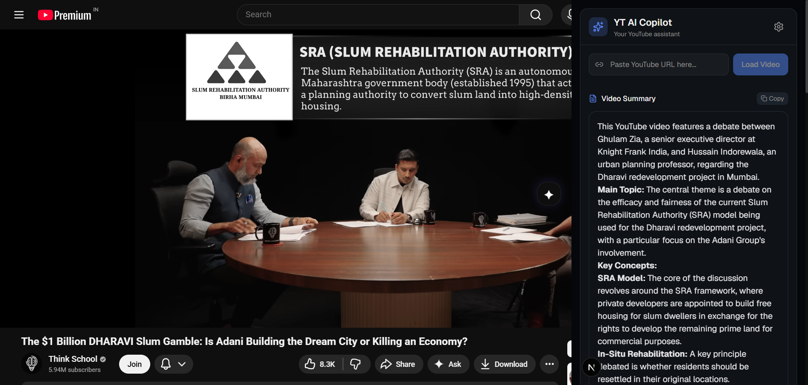
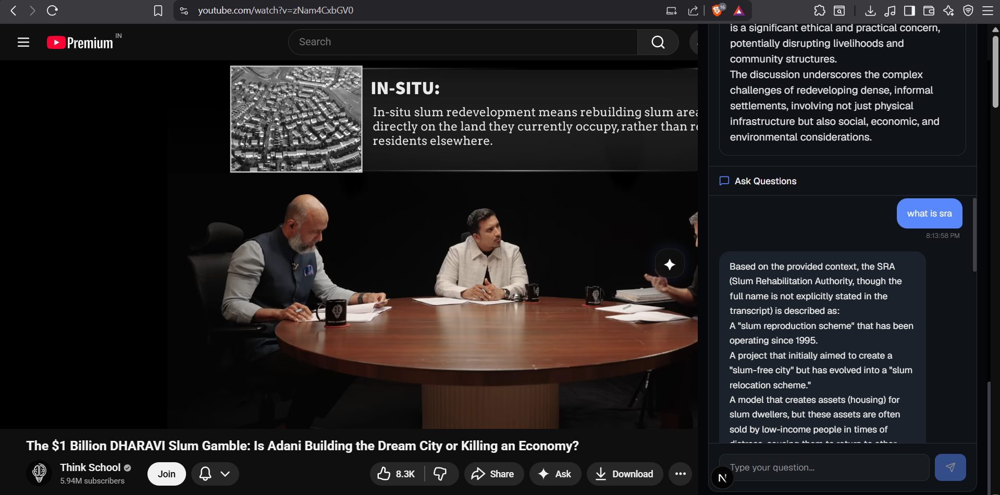
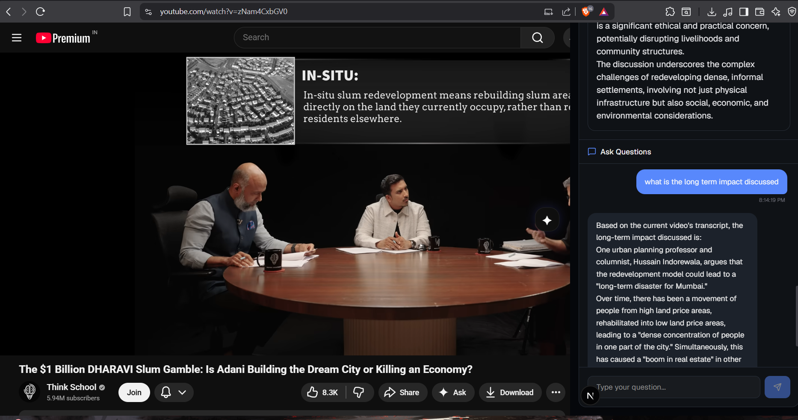

<div align="center">

# ✨ YT AI Copilot

### 🧠 AI-Powered YouTube Learning Assistant


---

### 🚀 Transform YouTube videos into an AI-powered interactive learning experience

💬 Ask questions about videos  
📚 Get intelligent summaries  
🔍 Perform semantic search  
🎯 Discover related videos  
⚡ Use directly inside YouTube

</div>

---

# 🌌 Demo Preview

<div align="center">

## 🎥 Chrome Extension Sidebar


</div>

---

# ✨ Features

<table>
<tr>
<td width="50%">

## 🧠 AI Summaries
Get beautifully formatted summaries for any YouTube video instantly.

</td>

<td width="50%">

## 💬 Conversational AI Chat
Ask contextual questions about the video using RAG.

</td>
</tr>

<tr>
<td width="50%">

## 🔍 Semantic Search
Search meaning, not keywords, using embeddings + vector retrieval.

</td>

<td width="50%">

## 🎯 Related Videos
Discover semantically similar videos powered by vector similarity.

</td>
</tr>

<tr>
<td width="50%">

## 🌐 Chrome Extension
Integrated directly into YouTube as a floating AI sidebar.

</td>

<td width="50%">

## ⚡ Modern UI/UX
Dark-themed animated interface with markdown rendering.

</td>
</tr>
</table>

---

# 🏗️ System Architecture

<div align="center">



</div>

---

# 🧠 How The AI Pipeline Works

---

## 🎥 Step 1 — Video Detection

The Chrome extension automatically detects the currently opened YouTube video.

```javascript
window.postMessage({
   type: "YOUTUBE_URL",
   url: location.href
})
```

---

## 📄 Step 2 — Transcript Extraction

The backend extracts video transcript data and converts it into raw text.

---

## ✂️ Step 3 — Chunking

Large transcripts are split into semantic chunks using:

```python
RecursiveCharacterTextSplitter
```

This improves:
- retrieval quality
- embedding precision
- semantic understanding

---

## 🤗 Step 4 — Embeddings

Each chunk is converted into vector embeddings using:

```text
sentence-transformers/all-MiniLM-L6-v2
```

This enables:
- semantic similarity
- vector search
- meaning-based retrieval

---

## 🗂️ Step 5 — ChromaDB Storage

Embeddings are stored in ChromaDB along with metadata:

```python
{
   "video_id": "...",
   "url": "..."
}
```

---

## 🔎 Step 6 — Retrieval-Augmented Generation (RAG)

When the user asks a question:

1. Retriever finds relevant chunks
2. Context injected into prompt
3. Gemini generates grounded answers

---

## 🎯 Step 7 — Semantic Recommendations

Global retriever searches across all indexed videos to recommend semantically related content.

---

# ⚙️ Tech Stack

<div align="center">

| Category | Technology |
|---|---|
| ⚛️ Frontend | Next.js + React |
| 🎨 Styling | Tailwind CSS |
| 🐍 Backend | Flask |
| 🧠 AI Framework | LangChain |
| 🤖 LLM | Gemini 1.5 Flash |
| 🤗 Embeddings | HuggingFace MiniLM |
| 🗂️ Vector Database | ChromaDB |
| 🌐 Browser Integration | Chrome Extension |
| 📄 Transcript API | YouTube Transcript API |

</div>

---

# 🧩 Folder Structure

```bash
YT-AI-Copilot/
│
├── backend/
│   ├── app.py
│   ├── main.py
│   ├── requirements.txt
│
├── frontend/
│   ├── app/
│   ├── components/
│   ├── services/
│
├── extension/
│   ├── manifest.json
│   ├── content.js
│
└── README.md
```

---

# 🚀 Installation

---

## 1️⃣ Clone Repository

```bash
git clone https://github.com/YOUR_USERNAME/YT-AI-Copilot.git

cd YT-AI-Copilot
```

---

# 🐍 Backend Setup

```bash
cd backend

python -m venv venv

venv\Scripts\activate

pip install -r requirements.txt
```

Create `.env`

```env
GOOGLE_API_KEY=your_api_key
```

Run backend:

```bash
python app.py
```

---

# ⚛️ Frontend Setup

```bash
cd frontend

npm install

npm run dev
```

---

# 🌐 Chrome Extension Setup

1. Open Chrome
2. Go to:

```text
chrome://extensions
```

3. Enable:

```text
Developer Mode
```

4. Click:

```text
Load Unpacked
```

5. Select:

```text
extension/
```

---

# 🧠 Engineering Challenges Solved

---

## ⚡ Gemini API Quota Exhaustion

### Problem
Gemini embedding quotas were quickly exhausted.

### Solution
✅ Switched embeddings to HuggingFace  
✅ Reduced embedding API dependency  
✅ Optimized chunking pipeline

---

## 🗂️ Embedding Dimension Mismatch

### Problem

```text
Expected dimension 3072, got 384
```

### Cause
Switching from Gemini embeddings → HuggingFace embeddings.

### Solution
✅ Rebuilt ChromaDB collections

---

## 🔎 Irrelevant Recommendations

### Problem
Related videos were semantically weak.

### Solution
✅ Created separate global retriever architecture  
✅ Used video summaries for semantic recommendations

---

## 🌐 Extension Communication

### Problem
Needed communication between YouTube page and React app.

### Solution
✅ iframe architecture  
✅ postMessage communication system

---

## 📄 Markdown Rendering

### Problem
AI responses rendered poorly.

### Solution
✅ ReactMarkdown  
✅ Tailwind Typography styling

---

# 📸 Screenshots

## 🌌 Main Sidebar



---

## 💬 AI Chat




---

## 🎯 Related Videos


---

# 📈 Future Improvements

- ⚡ Streaming AI responses
- 🕒 Timestamp-based citations
- ☁️ Cloud deployment
- 🎙️ Voice interaction
- 📚 Playlist understanding
- 🧠 Multi-video memory
- 🔐 User authentication

---

# 👨‍💻 Author

<div align="center">

## Shlok Mishra

### 🚀 Generative AI Engineer

</div>

---

# ⭐ Support The Project

If you found this project interesting:

<div align="center">

### ⭐ Star the repository

### 🍴 Fork the project

### 🚀 Build something awesome

</div>